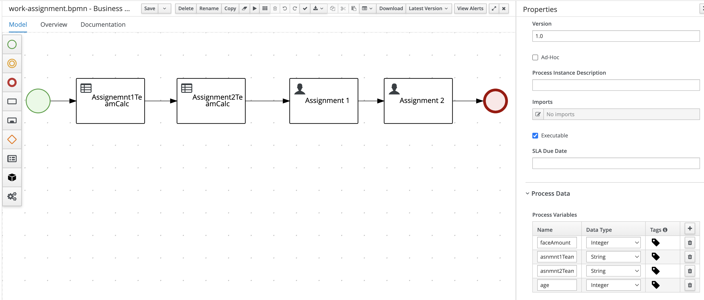
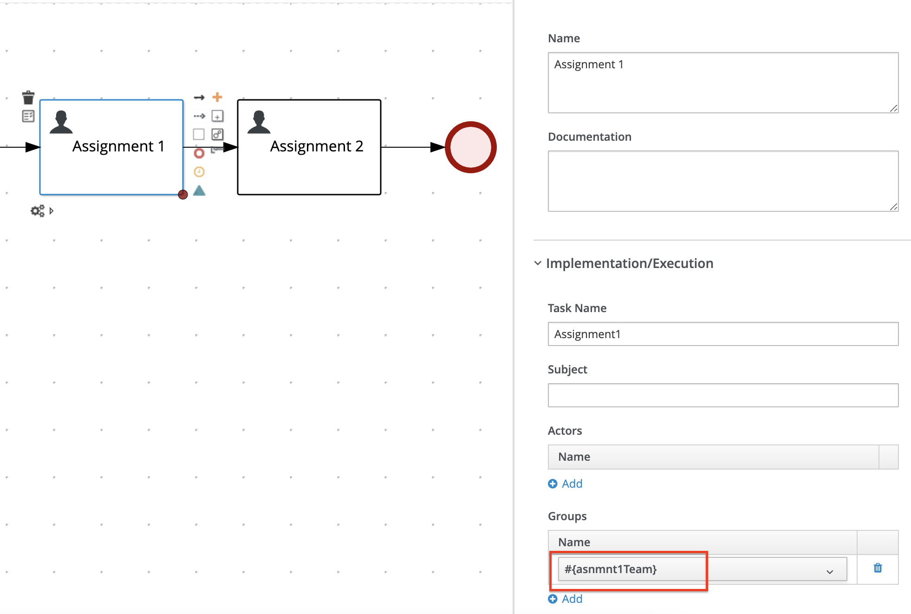
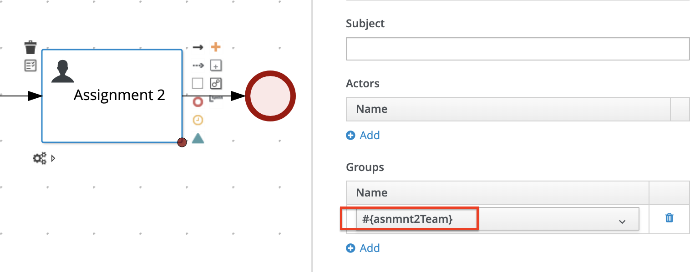

# Process

Using this example to explain the User Assignment groups.

There are two user tasks (Assignment 1 & Assignment 2) in this example.

 

# Assignment1 Group calculation

Assignment 1 Group will be calculated by DMN Rules.

| Face Amount                 | Group		|
| --------------------------: | ------- |
| Less than or Equals 100000  | Lloyds  |
| Greater than 100000         | Company |

 

# Assignment2 Group calculation

Assignment 2 Group will be calculated by DMN Rules.

Age                     | Group
----------------------: | -------
Less than or Equals 45  | Lloyds
Greater than 45         | Company

 